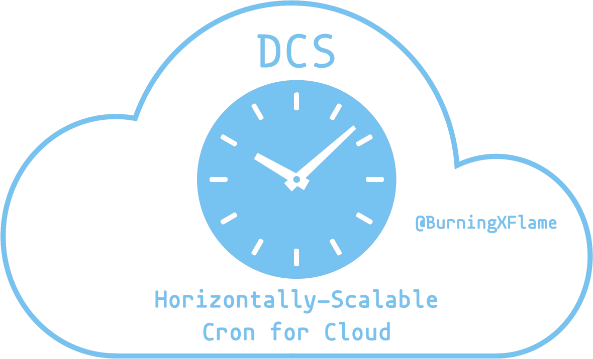

# DCS - Horizontally-Scalable Cron for Cloud

DCS is a Truly-Distributed, Load-Balanced and Horizontally-Scalable Job Scheduling System for Cloud-Native environments.
This architecture provides the best scalability and reliability. In other words:

- DCS effortlessly scales as your business grows. In theory, there’s no scalability cap, i.e. you can achieve unlimited throughput by specifying an unlimited number of replicas.
- Zero downtime during scaling out/in.
- Zero downtime during upgrade.

DCS also makes some enhancements in fine-grained reliability.

- Zero downtime on time zone changes. Time zone changes are automatically detected and applied at runtime with zero downtime.
- Zero downtime on temporary errors. Auto-recover on temporary errors.
- Zero downtime on process crash. Auto-recover on process crash.

## Use

### CR

Just create a CR to define a job and that's it. The job will reliably run as expected.

Let's start with the simplest example.

```yaml
apiVersion: ext.burningxflame.github.com/v1
kind: CronJob
metadata:
  name: someName
  namespace: someNamespace
spec:
  expr: "* * * * *" # cron expression
  callback: # regularly called on the specified schedule
    http:
      url: http://someHost/somePath
```

To learn more, view the [complete list of all features](https://www.bxflame.com/dcs/doc/pricing/), and go through the docs for detailed description of each feature.

### RESTful

RESTful API is also available.

Let's take the same example as above.

**Request**

- Method: `PUT`
- URL: `https://dcs:1058/jobs/some-ns/some-name`
- Header: `Content-Type: application/json`
- Body:

  ```json
  {
    "expr": "* * * * *",
    "callback": {
      "http": {
        "url": "http://somehost/somepath"
      }
    }
  }
  ```

**Response**

- StatusCode: `200`
- Body: `{"msg": "OK"}`

To learn more, view the [RESTful API docs](https://www.bxflame.com/dcs/doc/rest/).
